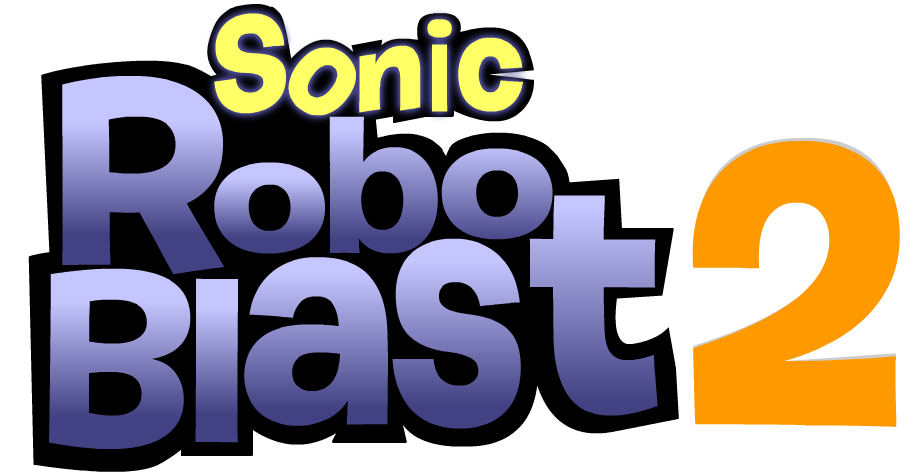

# Sonic Robo Blast 5b (SRB2 BFDIA 5b addon)

  

> SRB5b is an addon

SRB5b tries to accurately port the gameplay of _BFDIA 5b_ into the 3D fan game _Sonic Robo Blast 2_.

This addon is open assets so feel free to use anything in the addon in _your_ addon, credit would be cool or [join the Discord (I like seeing people join)](https://discord.com/invite/PZufdewhH5)

If you've found the addon interesting please do check out the [website!](https://sites.google.com/view/srb5b/home "The home page of the website") We have documentation about features and commands, the source files (.fla and .ase) and more.

To download builds of the mod you can either [join the Discord (link directs you to the channel where you'd find the builds)](https://discord.com/invite/PZufdewhH5) or [have a look at the Message Board page](https://mb.srb2.org/addons/srb5b-bfdia-5b.6216/history "All uploaded files to the MB")

## [Credits](https://sites.google.com/view/srb5b/extras/team-srb5b-credits)
